# LoRa Radio shield 与 LoRaWan通信

## LoRaWan配置

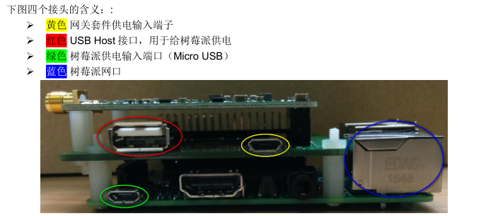

请按下图所示，连接短 USB 线（15CM）、长 USB 线（1M）及 5V 适配器。

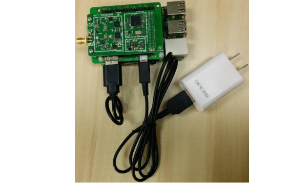

按下图所示将串口与树莓派接到一起

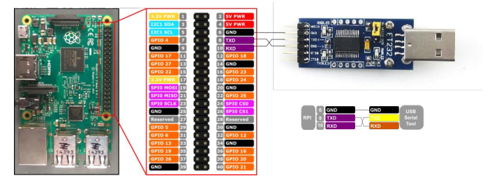

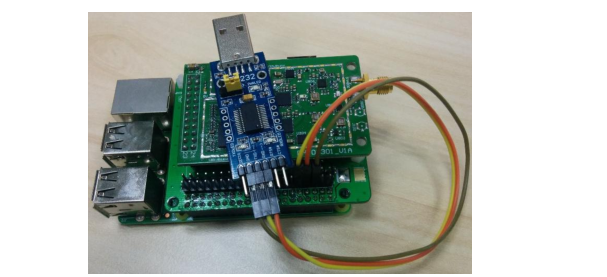

* 首先根据上文确保串口与树莓派（RHF4T002）连接无误
* 连接串口至 PC（如果串口无法正常被识别，参见串口驱动安装相关章节）；
* 打开设备管理器查看串口号。以 COM15 为例，配置 ExtraPuTTY 如下(选择 Serial 项，填入波特率115200，其他项选用默认值即可)，点击“Open”。由于目前网关还没有上电，所以打开后黑色界
面没有任何响应。

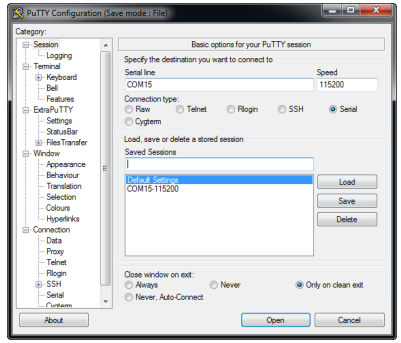

* 将网关上电，上电后 ExtraPuTTY 上会快速打印树莓派的启动日志，启动后会弹出登录提示，这里需要注意，从树莓派启动到弹出登录提示需要大约 1~2 分钟；

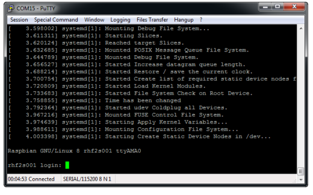

* 使用 RHF2S001 的用户名及密码登录，默认用户名 rxhf，密码 risinghf，请注意输入密码时，ExtraPuTTY 没有回显；

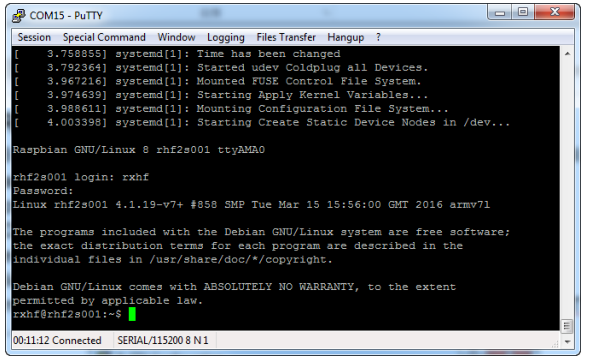

* 插入网线，将 RHF2S001 与路由器相连；（提示：如已插好网线，请略过此步骤，启动之前连接网线没有任何影响，将连接网线安排在此处是为了描述方便）
* 执行 ifconfig 查看获得的 ip 及 mac 地址；下图中红色圈圈中的为 IP 地址，白色圈圈中的为网卡地址（格式为：b8:27:eb:xx:xx:xx）。

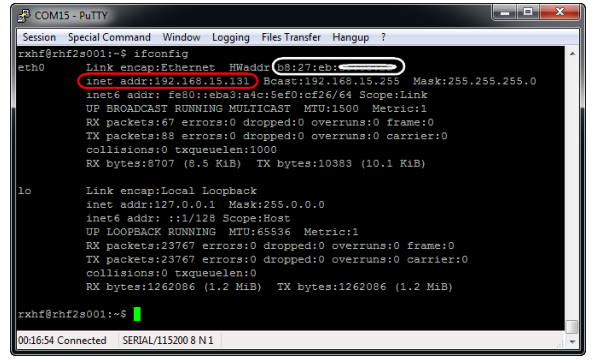

* 利用之前得到的 IP 在浏览器里访问服务器后台。如下图所示：

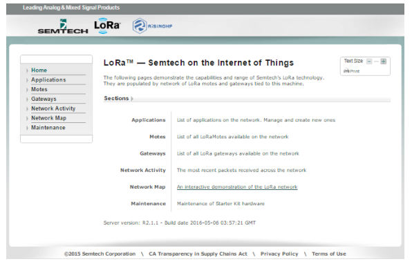

## LoRa Radio shield节点配置

* 点击这里下载[LoRa Radio shiled代码](https://github.com/delongqilinksprite/LoRa_Radio_with_LoRaWan.git)
* 将此代码放到Arduino IDE目录下的：arduino-xxx/libraries/目录下
* 打开Arduino IDE，找到代码并打开

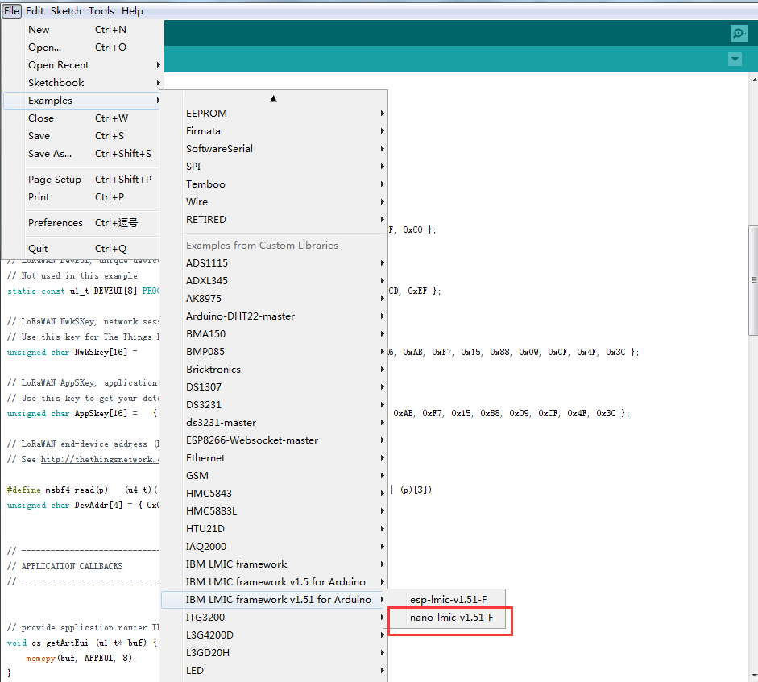

* 将LoRa Radio Shield接上Arduino Uno，并将Arduino Uno接上电脑，选择相应的串口，上传代码

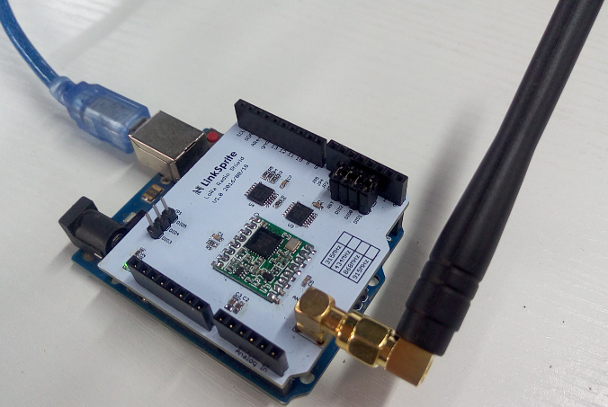

## 将节点信息配置到LoRaWan本地服务器

在LoRaWan本地服务器上填上如下信息：
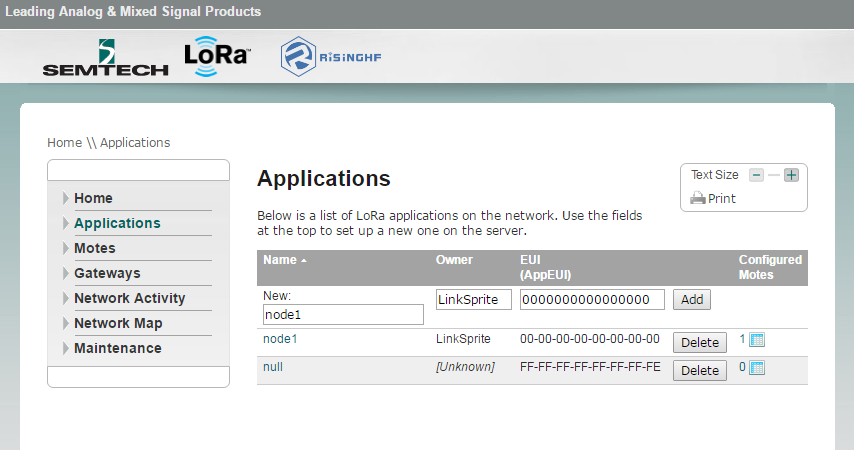

在LoRa Radio shiled的程序中获得DevEUI、DevAddr、AppSKey、NwkSKey信息：

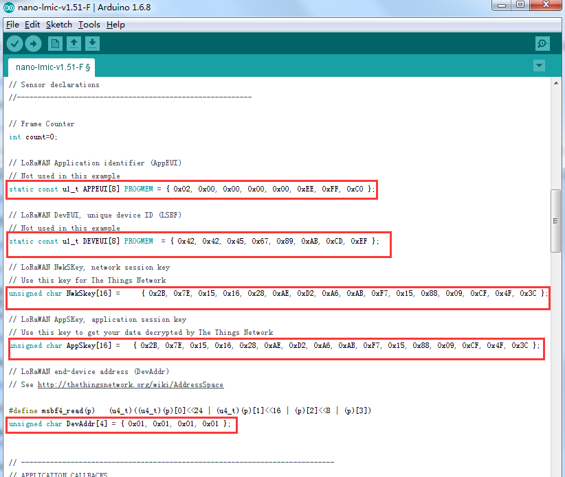

将上面所获得的信息填写到LoRaWan本地服务器上面：


## 开启LoRaWan数据接收服务

* 通过以下命令检查状态：

```
sudo systemctl status pktfwd
```

* 如果 pktfwd service不是active状态, 输入以下命令启动它:

```
sudo systemctl enable pktfwd 
```

```   
sudo systemctl restart pktfwd
```

* 频率配置：

```
cd ~/risinghf/pktfwd
```

输入以下命令，根据自己的频率来：


```
CN470
ln -sf global_conf_cn470.json global_conf.json
```

```
CN433
ln -sf global_conf_cn433.json global_conf.json
```

```
AS920
ln -sf global_conf_as920.json global_conf.json
```

```
EU868
ln -sf global_conf_eu868.json global_conf.json
```

Detailed channel definition:

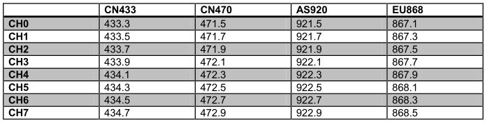

* 通过以下命令重启gateway service，使之生效：

```
sudo systemctl restart pktfwd
```

* 启动节点设备然后就可以看到设备节点发来的信息了，如果需要添加多个设备可以修改设备节点代码的参数：

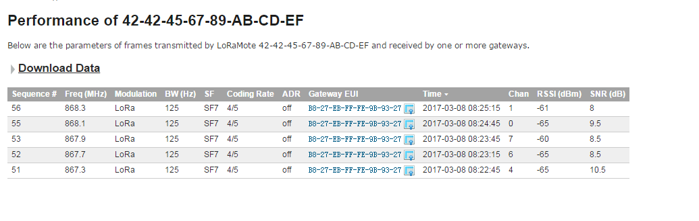

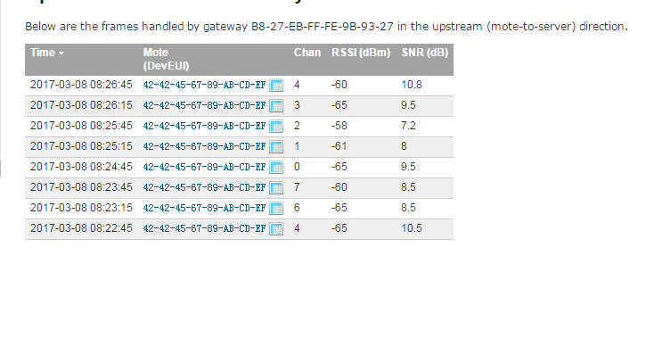

## 相关信息

* 停止 pktfwd

```
sudo systemctl stop pktfwd
```

* 硬件复位

```
cd ~/risinghf/test
```

```
sudo gwrst
```

* LoRaWan连接检测

```
./test_loragw_reg
```

* LoRaWan接收信息检测  

```
./util_rx_test -c /home/rxhf/risinghf/test/cfg/freq_conf_868.json
```

####### Different frequency use different configuration file, syncword34 directory contains LoRaWAN format data packet receiving configuration file


* LoRaWan发送信息检测 

Use util_tx_test and util_tx_continuous, refer to the help information (-h parameter
could be used to get help information)

```
Channel scan to use util_rssi_histogram (Note: SX1301 RSSI value precision is very limited).
Detailed usage:
rxhf@rhf2s001:~/risinghf/test$ ./util_rssi_histogram -h
Available options:
-h print this help
--file log file name
--fmin start frequency in Hz, default is 863 MHz
--fmax stop frequency in Hz, default is 870 MHz
--fstep frequency resolution in Hz, default is 50 kHz
-n number of RSSI captures, each capture is 4096 samples long, default is 90 (3s for 125Khz capture rate)
-p div ratio of capture rate (32 MHz/p), default is 256 (125 kHz)
Eg:
./util_rssi_histogram --fmin 470000000 --fmax 471000000 --file a.csv
```

关于LoRa Radio shield更多相关信息：  
[http://linksprite.com/wiki/index.php5?title=Lora_Radio_Shield](http://linksprite.com/wiki/index.php5?title=Lora_Radio_Shield)
